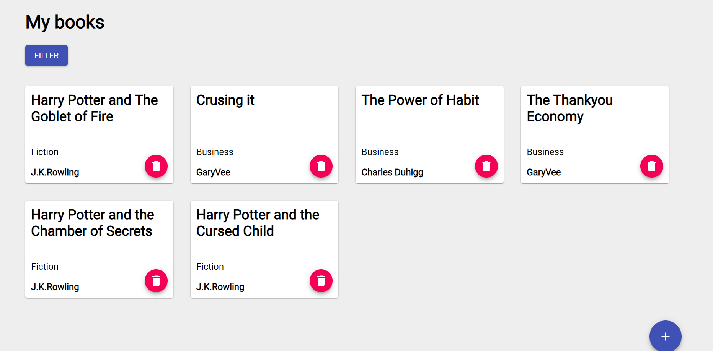
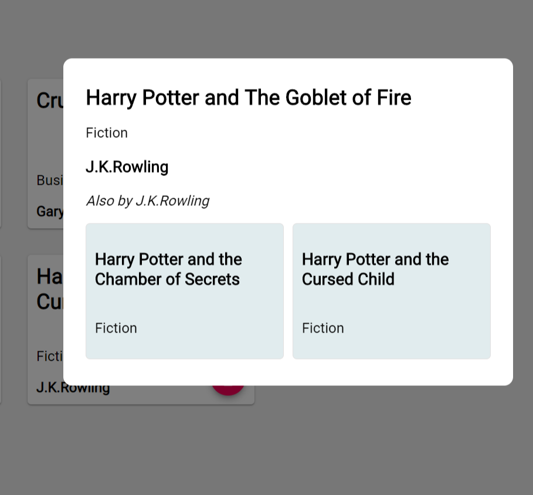
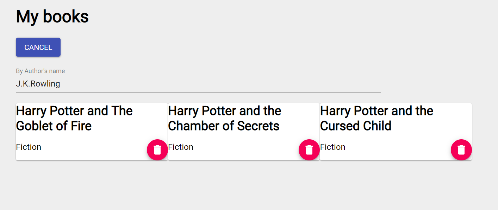
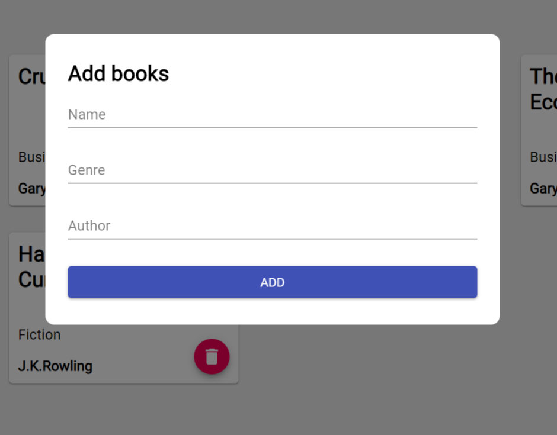

# Bookshelf
A full-stack web application allow users to store, edit and add more items to their digital bookshelf. 
## Installation
```javascript
  npm install
  npm install -prefix client
  npm run dev
```

## Tech stack
### Back-end
* NodeJS, Express, MongoDB, GraphQL
### Front-end
* React, Apollo Client, MaterialUI

## Demo
### Book collection

### Book info

### Filter books by author

### Add book



